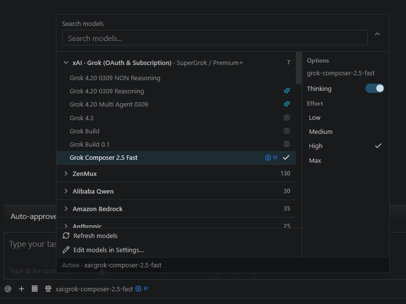
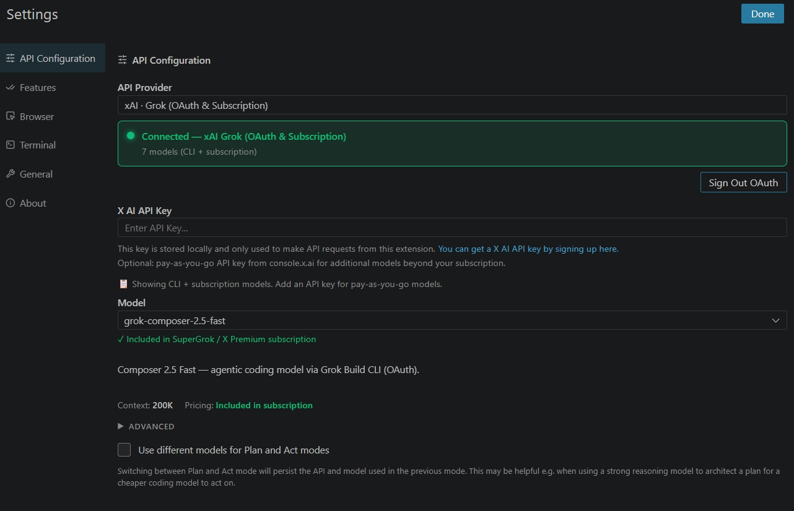

# iCline

<!-- icline:version -->
> 📦 **Current version:** `0.1.13` · [Releases](https://github.com/i-mrDedchai/iCline/releases) · [Changelog](https://github.com/i-mrDedchai/iCline/blob/main/apps/vscode/CHANGELOG.md) · [Repo](https://github.com/i-mrDedchai/iCline)
<!-- /icline:version -->

<!-- icline:repo -->
🔗 **GitHub:** [i-mrDedchai/iCline](https://github.com/i-mrDedchai/iCline)
<!-- /icline:repo -->

🌐 **Languages:** English (this page) · [ภาษาไทย](README.th.md)

**iCline** is a fork of [Cline](https://github.com/cline/cline) packaged as a separate VS Code extension (`i-mrdedchai.iCline`) — install it alongside the official Cline extension (`saoudrizwan.claude-dev`) without conflicts.

---

## ✨ Why iCline?

| | Cline official | iCline |
|---|---|---|
| Extension ID | `saoudrizwan.claude-dev` | `i-mrdedchai.iCline` |
| ⚡ Quick Provider & Model picker on chat | ❌ | ✅ |
| 🔐 xAI OAuth (SuperGrok / X Premium) | ❌ | ✅ |
| ⚡ Composer 2.5 Fast, Grok Build | ❌ | ✅ |
| 🌐 ZenMux (100+ models) | ❌ | ✅ |
| 🛡️ Harness guardrails (verify-before-claim) | ❌ | ✅ |
| 🔄 Dual-channel updates (iCline + upstream) | ❌ | ✅ |

### ⚡ Quick Provider & Model picker (chat)

| | Cline official | iCline |
|---|---|---|
| ⚡ Quick Provider & Model picker on chat | ❌ | ✅ |

Switch providers and models **without leaving the chat** — search all providers, collapse/expand model lists, set **Thinking / Effort per model** on hover, and refresh dynamic catalogs.

<p align="center">
  
</p>

The full provider catalog and deep model settings remain in **Settings → API Configuration**:

<p align="center">
  
</p>

---

## 🚀 Getting started

1. Open the **Activity Bar** and click the iCline icon (or `Ctrl+Shift+P` → `iCline: Open In New Tab`)
2. Go to **Settings** ⚙️ → choose a Provider
3. Select **xAI · Grok (OAuth & Subscription)** and click **Sign in to xAI Grok** for OAuth  
   Or enter an **API Key** / use auth from **Grok CLI** (`~/.grok/auth.json`)
4. Pick a model such as **Composer 2.5 Fast** or **Grok Build**
5. Describe your task — iCline plans, reads code, edits files, and runs commands (after your approval)

> 💡 **Tip:** Open iCline in the right sidebar to review file changes side-by-side with Explorer.

---

## 📥 Install from VSIX

Download the latest `.vsix` from [GitHub Releases](https://github.com/i-mrDedchai/iCline/releases), then:

```bash
code --install-extension i-mrdedchai.iCline-0.1.13.vsix --force
```

Or build locally:

```powershell
cd apps/vscode
npm install
npm run package:vsix
code --install-extension dist/i-mrdedchai.iCline-0.1.13.vsix --force
```

---

## 🤖 Supported xAI models

- ⚡ **Composer 2.5 Fast** — primary coding agent model
- 🔨 **Grok Build** — build / implementation tasks
- 🧠 **Grok 4.3** and other Grok models as xAI enables them

---

## 🎯 Features beyond Cline official

### 🔐 xAI · Grok (OAuth & Subscription)
- Browser sign-in (PKCE OAuth) — SuperGrok / X Premium
- Automatic token refresh
- Reads session from Grok CLI when already logged in
- API key from console.x.ai (pay-as-you-go)

### 🛡️ Agent harness (Fable-style guardrails)
- **Verify-before-claim** — no success claims without verification
- **Post-write verification** — checks files after save
- **Compaction threshold clamp** — limits threshold to 0.5–0.95

### 🔄 Dual-channel updates
- Checks **iCline releases** on GitHub
- Notifies about new **Cline upstream** versions (no auto-merge)
- Command: `iCline: Check for Updates (iCline & Cline upstream)`

---

## ⚙️ Settings

| Setting | Description | Default |
|---|---|---|
| `iCline.updates.enabled` | Enable update checks | `true` |
| `iCline.updates.releasesUrl` | GitHub Releases API URL | `https://api.github.com/repos/i-mrDedchai/iCline/releases/latest` |
| `iCline.updates.notifyUpstreamCline` | Notify Cline upstream | `true` |
| `iCline.updates.checkIntervalHours` | Check interval (hours) | `24` |

---

## 🌐 ZenMux

**ZenMux** provider supports the full ZenMux feature set:

- 👤 **Account**: Sign in (Email / GitHub / Google) via Settings links
- 🔑 **API Key**: Pay As You Go (`sk-ai-v1-`) and Builder Subscription (`sk-ss-v1-`)
- 📊 **Management API Key**: PAYG balance and subscription quota
- 🔌 **Protocols**: OpenAI Chat, Anthropic Messages, OpenAI Responses, Google Gemini/Vertex
- 📋 **Models**: Auto-fetched from ZenMux (100+ models)

## 🔌 Other providers

Beyond xAI and ZenMux, iCline supports all original Cline providers: Anthropic, OpenAI, OpenRouter, Google Gemini, AWS Bedrock, Azure, LM Studio/Ollama, MCP, and more.

---

## 🔒 Safe updates

- Updating Cline official **will not remove** iCline
- Updating iCline **will not remove** Cline official
- Sync upstream code: `scripts/sync-upstream.ps1`

---

## 📄 Auto-synced docs

On every `npm run package:vsix` or `vscode:prepublish`, `scripts/sync-icline-docs.mjs` syncs README, CHANGELOG, `package.json`, and provider labels.

---

## 📜 License

Apache-2.0 — derived from [Cline](https://github.com/cline/cline)